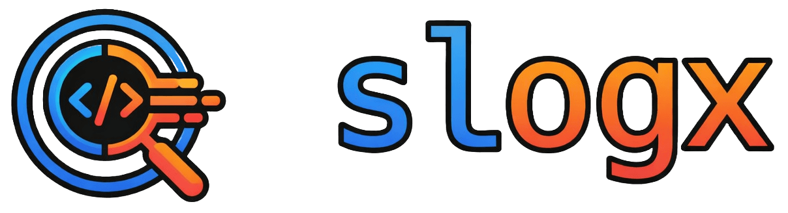

# slogx — good ol' print debugging, but better

slogx is a structured logging toolkit for backend developers. One SDK gives you two ways to view logs: stream them live to a browser UI during local development, or write them to a file during CI and replay them later. Same logging calls, different outputs depending on the environment.

https://github.com/user-attachments/assets/616ddfb8-20f5-48fe-be58-0dd64e3a0fa3

## Quickstart

Install the SDK for your language, call `init()` once, and start logging:

```js
// npm install @binhonglee/slogx
import { slogx } from '@binhonglee/slogx';

slogx.init({ isDev: true, port: 8080, serviceName: 'api' });
slogx.info('Server started', { port: 8080 });
```

To view logs locally, run the UI:

```bash
git clone https://github.com/binhonglee/slogx.git
cd slogx && npm install && npm run dev
```

Open `http://localhost:3000/app.html` and connect to `localhost:8080`.

## SDK Reference

### init() options

| Option | Type | Default | Description |
|--------|------|---------|-------------|
| `isDev` | boolean | required | Safety flag to prevent accidental production use |
| `port` | number | 8080 | WebSocket server port (live mode) |
| `serviceName` | string | required | Identifies the service in logs |
| `ciMode` | boolean | auto | Force CI mode; auto-detects CI environments if not set |
| `logFilePath` | string | `./slogx_logs/<serviceName>.ndjson` | Output file path for CI mode |
| `maxEntries` | number | 10000 | Max log entries before rolling (CI mode) |

### Logging methods

All SDKs provide: `debug`, `info`, `warn`, `error`

Each accepts a message string and optional data (objects, errors, arrays).

### Language examples

**Node.js**
```js
// npm install @binhonglee/slogx
import { slogx } from '@binhonglee/slogx';

slogx.init({
  isDev: process.env.NODE_ENV !== 'production',
  port: 8080,
  serviceName: 'my-service'
});

slogx.info('Server started', { env: process.env.NODE_ENV });
slogx.error('Operation failed', new Error('timeout'));
```

**Python**
```py
# pip install slogx
import os
from slogx import slogx

slogx.init(
    is_dev=os.environ.get('ENV') != 'production',
    port=8080,
    service_name='my-service'
)
slogx.info('Started', {'env': 'dev'})
```

**Go**
```go
// go get github.com/binhonglee/slogx
import (
    "os"
    "github.com/binhonglee/slogx"
)

func main() {
    slogx.Init(slogx.Config{
        IsDev:       os.Getenv("ENV") != "production",
        Port:        8080,
        ServiceName: "my-service",
    })
    slogx.Info("Started", map[string]interface{}{"env": "dev"})
}
```

**Rust**
```rust
// cargo add slogx
#[tokio::main]
async fn main() {
    let is_dev = std::env::var("ENV").unwrap_or_default() != "production";
    slogx::init(is_dev, 8080, "my-service").await;
    slogx::info!("Started", { "env": "dev" });
}
```

## Viewing Modes

### Live Mode

In live mode (the default), the SDK starts a WebSocket server. Connect the slogx UI to see logs as they happen.

1. Your app calls `slogx.init()` — this starts a WebSocket server
2. Open the slogx UI (`/app.html`)
3. Enter your server's address (e.g., `localhost:8080`)
4. Watch logs stream in real-time

The UI auto-reconnects if the connection drops.

### Replay Mode (CI)

In CI mode, logs are written to an NDJSON file instead of being streamed. You can replay them later in the browser.

**Enable CI mode:**
```js
slogx.init({
  isDev: true,
  serviceName: 'api',
  ciMode: true,  // Force CI mode
  logFilePath: './slogx_logs/api.ndjson'
});
```

**Or let it auto-detect** — the SDK checks for these environment variables:
- `CI`, `GITHUB_ACTIONS`, `GITLAB_CI`, `JENKINS_HOME`, `CIRCLECI`, `BUILDKITE`, `TF_BUILD`, `TRAVIS`

**View replay logs:**
1. Open the replay UI (`/replay.html`)
2. Drop in an `.ndjson` file, paste a URL, or click **Try Demo CI Logs**
3. Browse logs with the same filtering and search as live mode

## GitHub Action

Automatically publish CI logs and comment a replay link on PRs:

```yaml
# .github/workflows/test.yml
- name: Run tests
  run: npm test  # Your app logs with ciMode: true

- name: Publish slogx replay
  uses: binhonglee/slogx/replay@main
  with:
    log_paths: ./slogx_logs/*.ndjson
    github_token: ${{ secrets.GITHUB_TOKEN }}
```

This pushes log files to a `slogx-artifacts` branch and comments a replay link on the PR.

**Action options:**

| Input | Default | Description |
|-------|---------|-------------|
| `log_paths` | required | Comma-separated paths to NDJSON files |
| `github_token` | required | Token with `contents:write` and `pull-requests:write` |
| `replay_base_url` | `https://binhonglee.github.io/slogx/replay.html` | URL to replay viewer |
| `artifact_branch` | `slogx-artifacts` | Branch for storing log files |
| `max_runs` | `500` | Max CI runs to keep before pruning |
| `comment` | `true` | Whether to comment on the PR |

## Message Format

Log entries are JSON objects with this schema:

```json
{
  "id": "<uuid>",
  "timestamp": "2025-12-22T12:34:56.789Z",
  "level": "INFO|DEBUG|WARN|ERROR",
  "args": [ /* JSON-serializable values */ ],
  "stacktrace": "optional stack trace",
  "metadata": {
    "file": "handler.go",
    "line": 123,
    "func": "handleRequest",
    "lang": "node|python|go|rust",
    "service": "my-service"
  }
}
```

In live mode, entries are sent over WebSocket (single object or array per message). In CI mode, entries are written as newline-delimited JSON (NDJSON).

## Testing & Development

```bash
npm run test        # Unit tests (Vitest)
npm run test:e2e    # E2E tests (Playwright)
npm run dev         # Start dev server
npm run build       # Build standalone HTML files
```
